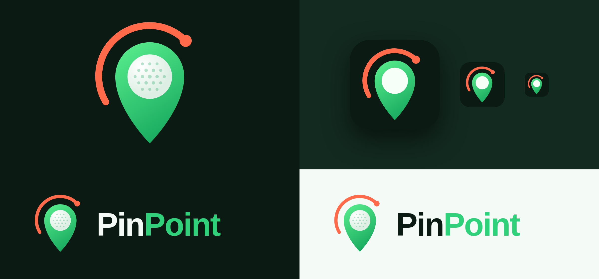

# PinPoint

PinPoint is a golf club and swing tracker. A **Tag** in each club's grip captures the swing,
a **Hub** on the bag relays the data over Bluetooth LE, and the **app** shows swing metrics
for each shot and keeps track of every club in the bag.

The app is at **`/pinpoint`**. It's a mobile-first web app that connects to the hub with
the Web Bluetooth API.

## Features

- **Connect**: pair with a PinPoint Hub over Bluetooth, or use **demo mode**, which simulates
  a hub (it sends real protocol packets) so you can try the app without hardware.
- **Swing**: shows each swing as it happens: club head speed, tempo (backswing:downswing),
  face angle, club path, attack angle, strike quality and estimated carry. It also shows a
  0–100 swing score, a down-the-line swing plane view, an impact and ball-flight diagram,
  and coaching tips.
- **Bag**: shows every club's tag status (in bag, in hand or missing) with signal strength,
  tag battery, and average speed and carry for each club. **Find my club** rings a lost
  club's tag and shows a hot/cold proximity meter.
- **History**: speed trend chart, gapping (average carry by club) and a full swing log. All
  of it is stored on the device.

## Browser support

Web Bluetooth works in Chrome and Edge on Android, macOS, Windows and ChromeOS, and needs
HTTPS (or `localhost`). iOS Safari doesn't support it, so iPhone users need a Web Bluetooth
browser such as Bluefy or a native wrapper. The protocol is plain GATT, so a native iOS or
Android app can use the same spec. Demo mode works in any browser.

## Code map

| Path | What |
|---|---|
| `src/app/pinpoint/` | Route, layout, favicon |
| `src/components/pinpoint/` | App shell, Home, Swing, Bag and History views, logo, graphics |
| `src/lib/pinpoint/protocol.ts` | GATT UUIDs and packet encode/decode |
| `src/lib/pinpoint/link.ts` | `PinPointLink` interface and the Web Bluetooth implementation |
| `src/lib/pinpoint/simulator.ts` | Demo hub |
| `src/lib/pinpoint/analysis.ts` | Shot shape, swing score and coaching tips |
| `src/lib/pinpoint/clubs.ts` | Club catalog and carry estimate |
| `docs/pinpoint/BLE_PROTOCOL.md` | Hardware ⇄ app protocol spec |
| `public/pinpoint/` | Logo mark, wordmarks, app icon (SVG + 1024 px PNG), brand sheet |

## Brand

| Token | Value | Use |
|---|---|---|
| Turf green | `#2FD27A` (gradient `#5BF08F` → `#0E9F58`) | Primary, the pin |
| Swing coral | `#FF6B4A` | Accent, the swing arc, warnings |
| Fairway night | `#0C1A14` | Background |
| Ball white | `#F7FFF9` | The ball |

The mark is a map pin (tracking where your clubs are) holding a golf ball, with a coral
swing arc around it (tracking how you swing).
